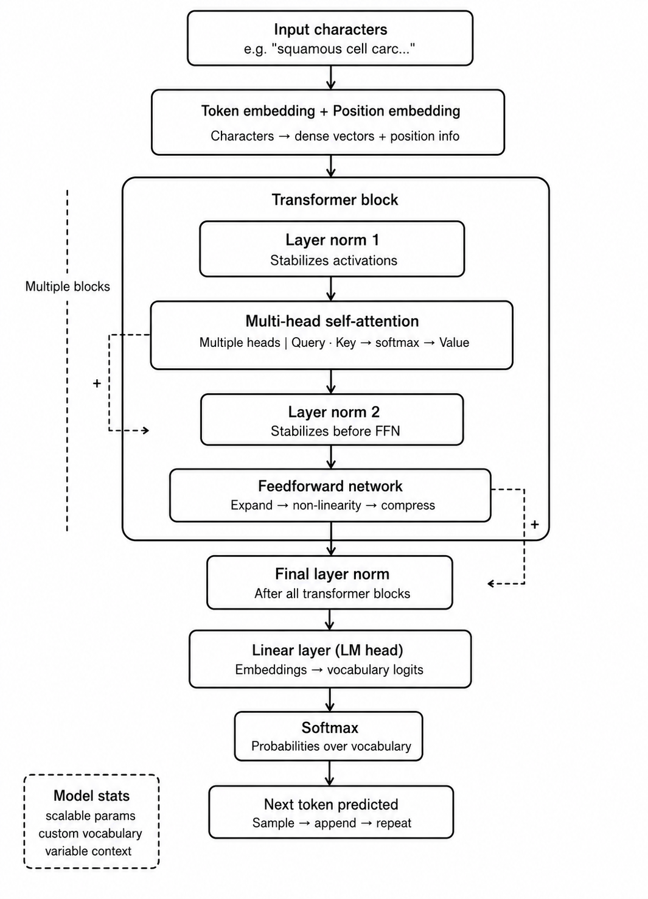

# A Small LLM Model trained on Pathology textbooks from scratch
This project showcases my understanding on LLMs.  
I trained a 10.8 million and 25 million parameter LLM model on 13 popular pathology textbooks suggested by a pathologist.  
This is a decoder only transformer, same as GPT-2, built from scratch

### What I Learned
- How transformers work at a fundamental level: self-attention,
  multi-head attention, residual connections, layer norm
- How to build and train a GPT from scratch using PyTorch
- Data pipeline: curating, cleaning and preprocessing 52M characters
  of medical text from 13 books
- GPU training on Google Colab and Kaggle
- How loss curves reflect model learning

---
### Final results from training:  
- train loss 0.8152, val loss 0.8794 on 25000th iteration while training the 25M parameter model
- train loss 1.0849, val loss 1.1107 on 10000th iteration while training the 10.8M parameter model
---
### Flowchart for the architecture used:


This project is inspired by Andrej Karpathy's TinyLLM architecture.

---
### Dataset
- 13 pathology textbooks recommended by a practicing pathologist
- Books include: Robbins & Cotran, Rosai & Ackerman, Greenfield's Neuropathology, 
  Sternberg's Diagnostic Surgical Pathology, and more
- 52.7 million characters of raw medical text
- Cleaned and preprocessed: removed index pages, table of contents, 
  page numbers, OCR artifacts
- Hosted on HuggingFace: [Pranjal888/Pathology_textbook_training_dataset](https://huggingface.co/datasets/Pranjal888/Pathology_textbook_training_dataset)

## How to Run

#### Clone repository
```bash
git clone https://github.com/8ven0m8/SmallLLM-Pathology-Model.git
```

#### Install dependencies
```bash
pip install -r requirements.txt
```

#### Run inference with the pretrained model
```bash
python inference.py
```
Then type a pathology related sentence in the terminal and it will try to complete it.

#### Sample I/O
```markdown
Enter prompt (or 'quit'): Microscopic examination of the renal biopsy revealed diffuse 
```

```markdown
Microscopic examination of the renal biopsy revealed diffuse features.
History of multiple sclerosis
In patients with occasional agents, the large powerful
mononuclear arrangements such reflect the adjacent volume in
nephrotic history.39 There are usually so lesser normal
excesses, and markers of Cushing s disease proved by frank
multiple sclerosis. Excessive illness are specific for residual extensions.Although less these
resolution is an increased severe mature cyst of another excess the
prostatic lymphatics, are present in the number of arteries are
di
```
This is only a 10.8 million parameter model trained on limited data and compute so the output is technically incorrect, but this demonstrates that the model learned some basic pathology terms and will definitely improve if it's trained on higher specs.

### Train from scratch
Open `SmallLLM_Pathology.ipynb` for 10.8 million parameter model and `25M_parameter_model.ipynb` for 25 million parameter model in Google Colab or Kaggle 
and run all cells.

---
